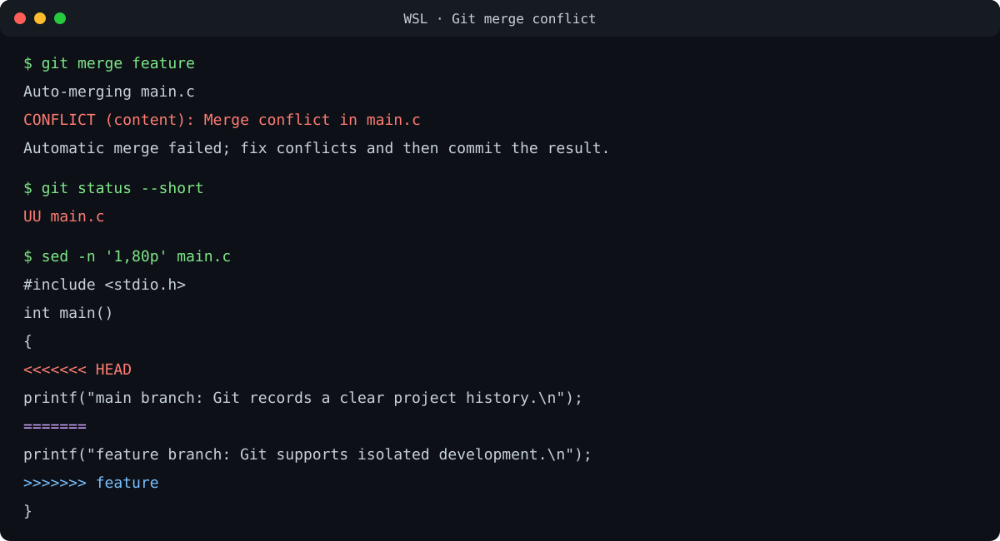
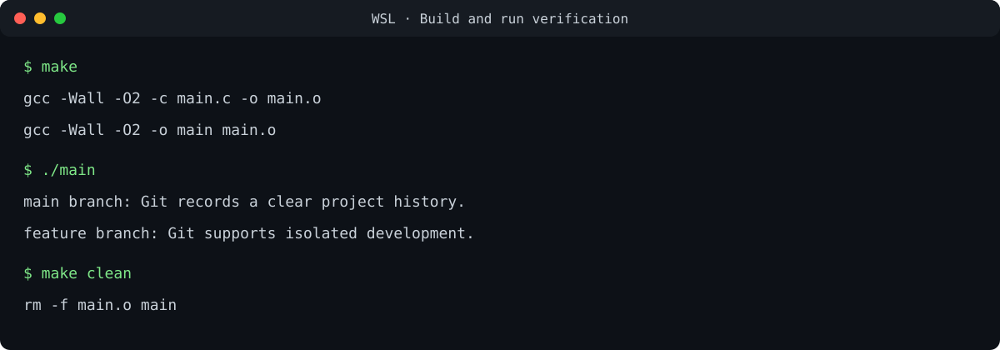

# Lab 0 实验报告：Git 与版本控制

> 本报告为匿名本地测试版本，不包含姓名、学号、邮箱等个人信息。

## 1. 实验目标

1. 熟悉 Git 的工作区、暂存区与本地仓库。
2. 掌握提交、分支、合并和冲突处理的基本流程。
3. 理解规范提交信息与语义化版本的价值。
4. 在 Linux 环境中完成 C 程序的编译与运行验证。

## 2. 实验环境

- Ubuntu 24.04.4 LTS（WSL 2，x86-64）
- Git 2.43.0
- GCC/G++ 13.3.0
- GNU Make 4.3
- GDB 15.1
- VS Code + Remote WSL

## 3. 文档问题回答

### 3.1 多人协同开发经历与协作方式

此前主要进行单人项目，尚无正式的大型多人协作经历。通过本次实验，我建立了一套可用于多人协作的基本流程：每个任务使用独立分支开发，完成后通过 Pull Request 进行讨论和代码审查，再合并到主分支；Issue 用来记录需求与缺陷，提交信息描述每次修改的目的。这样能减少直接修改主分支造成的相互干扰，也能明确每项修改的责任与背景。

### 3.2 Git 为什么设计“暂存—提交”两个步骤

工作区中的修改不一定属于同一个逻辑任务。如果修改文件后直接提交，调试代码、格式调整和功能实现可能被混在一起。暂存区提供了一个“准备本次快照”的中间层，开发者可以：

- 只选择与当前目标有关的文件或代码片段；
- 在提交前用 `git diff --staged` 再次检查内容；
- 把一次较大的工作区修改拆成多个原子提交；
- 修改暂存区而不丢失工作区中尚未准备提交的内容。

因此，“暂存—提交”并非重复操作，而是把“我正在修改什么”与“我要记录成哪个版本”分离，使历史更清晰、审查和回退更安全。

### 3.3 `git branch` 与 `git branch -a` 的区别

`git branch` 默认只列出本地分支，并用 `*` 标出当前分支；`git branch -a` 中的 `-a` 表示 `--all`，除了本地分支，还会列出远程跟踪分支，例如 `remotes/origin/main`。远程跟踪分支是本地对远程仓库状态的记录，并不等同于服务器端实时状态；需要先执行 `git fetch` 才能更新。

## 4. 指定资料阅读

### 4.1 Commit Message 规范

阅读：[Commit message 和 Change log 编写指南](https://www.ruanyifeng.com/blog/2016/01/commit_message_change_log.html)

文章介绍了结构化提交信息的价值及 Angular 风格。一次提交可由 Header、Body、Footer 组成，其中 Header 通常写作 `<type>(<scope>): <subject>`。`feat`、`fix`、`docs`、`refactor`、`test`、`chore` 等类型可以快速表明修改性质；Body 解释动机和行为变化；Footer 可记录破坏性变更或关联 Issue。规范的提交信息便于阅读历史、筛选修改、代码审查，并能自动生成 Change Log。

### 4.2 语义化版本

阅读：[语义化版本 2.0.0](https://semver.org/lang/zh-CN/)

语义化版本采用 `主版本号.次版本号.修订号`。不兼容的 API 变化提升主版本号，向后兼容的新功能提升次版本号，向后兼容的问题修复提升修订号；还可以添加预发布标识与构建元数据。它通过版本号传达兼容性信息，帮助使用者判断升级风险，也使依赖管理更可预测。

### 4.3 为什么要学习 Git

Git 不只是代码备份工具，更是管理变化的方法。它能记录“改了什么、为什么改、由谁在何时改”，允许创建分支进行低风险试验，并在出错时回到可靠版本。多人协作时，Git 提供可审查、可合并、可追踪的共同工作流；个人开发时，它同样能帮助拆分任务、比较方案和保留可复现的过程。规范提交信息与语义化版本进一步把内部修改历史转化为团队成员和软件使用者都能理解的信息。

## 5. 实验过程

### 5.1 完成 TODO 并提交

将 `main.c` 中的 TODO 替换为实际输出，并补充 `return 0;`。随后执行：

```bash
git add main.c
git commit -m "feat: complete greeting in main program"
```

生成提交 `1256bf1`。该提交只包含完成 TODO 所需的修改，保持了提交的原子性。

### 5.2 创建并修改 `feature` 分支

```bash
git switch -c feature
# 修改 main.c 中的输出语句
git add main.c
git commit -m "feat: add feature branch greeting"
```

生成提交 `665b4dd`。随后切回 `main`：

```bash
git switch main
# 修改 main.c 中同一行输出语句
git add main.c
git commit -m "feat: update main branch greeting"
```

生成提交 `91f0cc0`。两个分支从同一提交分叉，并修改同一文件的同一位置，因此合并时无法自动判断应保留哪一项修改。

### 5.3 制造并解决合并冲突

在 `main` 分支执行：

```bash
git merge feature
```

Git 报告 `CONFLICT (content)`，`git status --short` 显示 `UU main.c`。冲突现场如下：



我阅读冲突标记后，决定同时保留两个分支的有效信息，并删除 `<<<<<<<`、`=======`、`>>>>>>>` 标记。之后执行：

```bash
git add main.c
git commit -m "merge: resolve greeting conflict"
```

生成具有两个父提交的 merge commit `418d1be`。这次冲突说明：Git 能自动发现无法安全合并的区域，但最终语义必须由理解代码的人决定。

### 5.4 编译、运行与清理

```bash
make
./main
make clean
```

编译过程启用了 `-Wall -O2`，无警告、无错误；程序正常输出合并后的两条信息，清理后未残留二进制文件：



## 6. 结果验证

最终 `main.c` 为：

```c
#include <stdio.h>

int main()
{
    printf("main branch: Git records a clear project history.\n");
    printf("feature branch: Git supports isolated development.\n");
    return 0;
}
```

验证项目：

- TODO 已完成，程序可以编译并运行；
- `feature` 与 `main` 均存在独立修改提交；
- 合并时实际产生冲突，冲突已经人工解决；
- Git 历史保留分叉与合并结构；
- `make clean` 后工作区不包含编译产物。

## 7. 实验总结与建议

本次实验覆盖了从修改、暂存、提交到分支、冲突和合并的完整闭环。最重要的体会是：提交应围绕单一目的，分支用于隔离工作，而冲突不是 Git 的故障，而是需要开发者作出语义判断的提示。

建议课程后续补充 `git diff`、`git diff --staged` 与 `git log --graph --oneline --all` 的练习。这三个命令能直观展示工作区、暂存区和提交历史之间的差异，有助于理解 Git 的数据模型，而不仅是记忆操作步骤。
